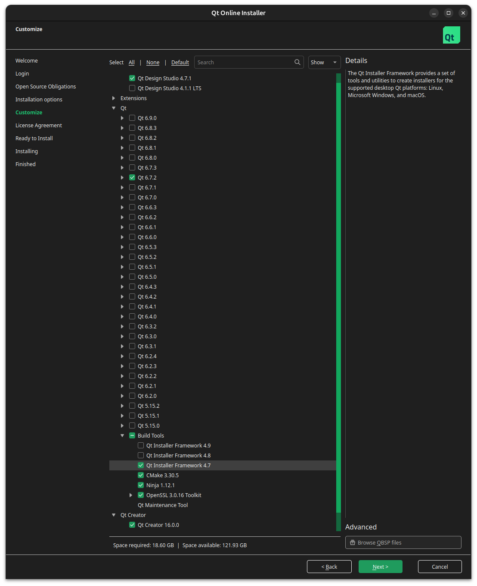

<p align="center">
    <picture>
        <source media="(prefers-color-scheme: dark)" srcset=".meta/logo-dark.png" width="40%" />
        <source media="(prefers-color-scheme: light)" srcset=".meta/logo-light.png" width="40%" />
        
    </picture>
</p>

# Gemstone Image Writer

 [](https://www.t3vakfi.org/en) [](https://opensource.org/licenses/Apache-2.0)

## How to use Gemstone Imager

Please see our [official documentation](https://docs.t3gemstone.org).

## Contributing

### Linux

#### Get dependencies

- Install the build dependencies (Ubuntu used as an example):

```sh
sudo apt install --no-install-recommends build-essential cmake git libgnutls28-dev
```

- Get the Qt online installer from: https://www.qt.io/download-qt-installer-oss
- During installation, choose Qt 6.7, CMake and Qt Creator.



#### Get the source

```sh
git clone --depth 1 https://github.com/t3gemstone/gem-imager
```

#### Build the AppImage

Modify appimagecraft.yml:

- First, you _must_ set Qt6_ROOT (as a extra_variables item under build/cmake) to the root of your Qt6 installation. eg: `/opt/Qt/6.7.2/gcc_arm64/` or `$HOME/Qt/6.7.2/gcc_arm64/`
- Second, you _must_ set QMAKE (as a raw_environment variable of the linuxdeploy plugin) to the full path of qmake inside that Qt6 installation. eg: `/opt/Qt/6.7.2./gcc_arm64/bin/qmake` or `$HOME/Qt/6.7.2./gcc_arm64/bin/qmake`

Now, use AppImageCraft to build your AppImage:

```sh
cd gem-imager
export LD_LIBRARY_PATH=${your_Qt6_install_path}/lib
./${your_platform_appimagecraft}.AppImage
```

Now mark the AppImage as executable, and run it:

```sh
chmod +x ./GemstoneImager-*.AppImage
./GemstoneImager-*.AppImage
```

### Windows

#### Get dependencies

- Get the Qt online installer from: https://www.qt.io/download-open-source
During installation, choose Qt 6.7 with Mingw64 64-bit toolchain, CMake and Qt Creator.

- For building the installer, get Nullsoft scriptable install system: https://nsis.sourceforge.io/Download

- It is assumed you already have a valid code signing certificate, and the Windows 10 Kit (SDK) installed.

#### Building

Building Gemstone Imager on Windows is best done with the Qt Creator GUI.

- Download source .zip from github and extract it to a folder on disk
- Open src/CMakeLists.txt in Qt Creator.
- Use Qt Creator to set the MINGW64_ROOT CMake variable to your MingGW64 installation path, eg `C:\Qt\Tools\mingw64`
- For builds you distribute to others, make sure you choose "Release" in the toolchain settings and not the Debug configuration.
- Menu "Build" -> "Build all"
- Result will be in build_gem-imager_someversion
- Go to the BUILD folder, right click on the .nsi script "Compile NSIS script", to create installer.

### macOS

#### Get dependencies

- Get the Qt online installer from: https://www.qt.io/download-open-source
During installation, choose Qt 6.7, CMake and Qt Creator.
- It is assumed you have an Apple developer subscription, and already have a "Developer ID" code signing certificate for distribution outside the Mac Store.

#### Building

- Download source .zip from github and extract it to a folder on disk
- Start Qt Creator and open src/CMakeLists.txt
- Use Qt Creator to set the Qt6_ROOT CMake variable to your Qt6 installation path, eg `/opt/Qt6/6.7.2/gcc_arm64`
- Menu "Build" -> "Build all"
- Result will be in build_gem-imager_someversion
- For distribution to others:
  - Use the IMAGER_SIGNED_APP flag to enable Application signing
  - Use the IMAGER_SIGNING_IDENTITY string to specify the Developer ID certificate Common Name
  - Use the IMAGER_NOTARIZE_APP flag to enable notarization as part of the build
  - Use the IMAGER_NOTARIZE_KEYCHAIN_PROFILE string to specify the name of the keychain item containing your Apple ID credentials for notarizing.

### Linux embedded (netboot) build

The embedded build runs under a minimalistic Linux distribution compiled by buildroot.
To build:

- You must be running a Linux system, and have the buildroot dependencies installed as listed in the buildroot manual: https://buildroot.org/downloads/manual/manual.html#requirement
- Run:

```sh
cd gem-imager/embedded
./build.sh
```

The result will be in the "output" directory.
The files can be copied to a FAT32 formatted SD card, and inserted in a Gemstone for testing.
If you would like to build a (signed) netboot image there are tools for that at: https://github.com/t3gemstone/usbboot/tree/master/tools

## Other notes

### Custom repository

If the application is started with "--repo [your own URL]" it will use a custom image repository.
So can simply create another 'start menu shortcut' to the application with that parameter to use the application with your own images.

### License

The main code of the Imaging Utility is made available under the terms of the Apache license.
See license.txt and files in "src/dependencies" folder for more information about the various open source licenses that apply to the third-party dependencies used such as Qt, libarchive, drivelist, mountutils and libcurl.
For the embedded (netboot) build see also "embedded/legal-info" for more information about the extra system software included in that.
